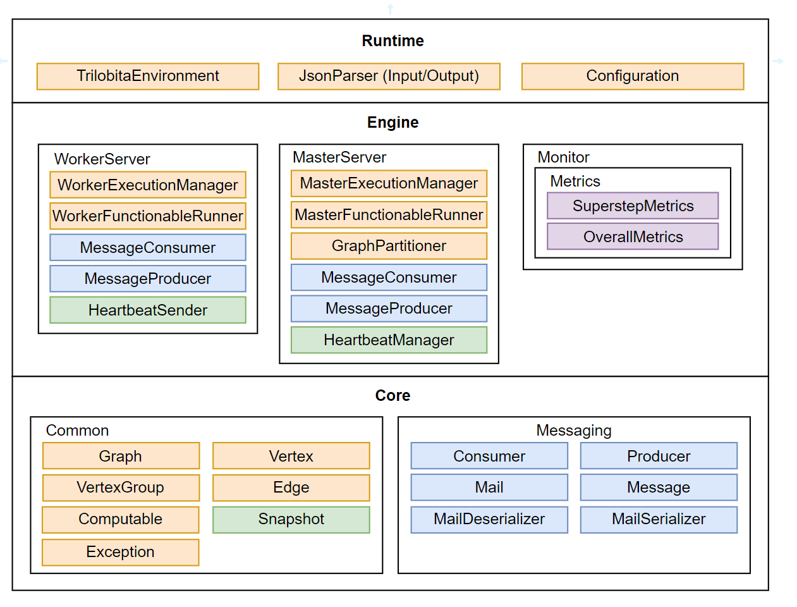
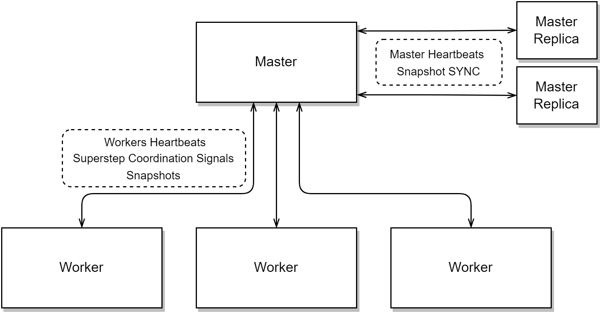

# *Trilobita*: A Distributed Graph Processing System


*Trilobita* is a *Pregel-like* distributed graph processing system implemented to handle large-scale graph processing tasks in a distributed environment efficiently. This is the 50.041 Distributive System group project.

## Overview

*Trilobita* is built to handle distributed graph processing tasks, providing a robust and fault-tolerant framework for efficient graph computation. We follow the ideas presented by Pregel, 

Throughout the development of *Trilobita*, we adhere to the following guiding principles.

1. **Fault Tolerance**: the system should be able to gracefully manage failures of both the master and worker servers, ensuring continuity in task execution and failure handling.
2. **Flexibility**: users of *Trilobita* should be empowered to customize their graph processing tasks and assemble operational clusters by using their personal laptops.
3. **Consistency**: the system should guarantee causal consistency during the computation and fault-handling process, providing a reliable and predictable environment for users.
4. **Efficiency**: the connection and communication between different machines should be efficient and adapt to varying cluster sizes for optimal performance.

## Team Members

*Trilobita* is developed by the following group members:

- Guo Yuchen
- Guo Ziniu
- Liang Junyi
- Wang Yanbao
- Xiang Siqi

## Architecture

### Overall Structure

Trilobita's architecture is structured into three layers: Core, Engine, and Runtime. Each layer builds upon the functionalities of the preceding one, providing a comprehensive and modular design.



Particularly, the relationships between the master, workers, and master replicas are illustrated below.



### Features

We implement a rich set of features in *Trilobita* to empower users with efficiency, reliability, and scalability in distributed graph processing.

* Distributed Graph Processing: *WokerServer*, *MasterServer*, *TrilobitaEnvironment*

* Fault Tolerance for Worker and Master: *Heartbeat*, *Snapshot*

* Functionable Instances: *Combiner*, *Aggregator*, *User Self-defined Functionable*

* Server Performance Monitor

* Scalable Cluster and Parallelism

* User-definable APIs: *Vertex*, *Computable*, *GraphParser*, *PartitionStrategy*

## Getting Started

### Dependencies

All dependencies required by *Trilobita* are listed in the  [maven pom file](https://github.com/TsukiSky/Trilobita/blob/main/pom.xml).

### Guide

To get started with *Trilobita*, proceed with these steps.

**Clone the Repository:**

```
git clone https://github.com/TsukiSky/Trilobita.git
```

**Install Dependencies:**

```
mvn install
```

**Run Examples:**

We implement two examples in the `examples` module, which can be run by the following sequence.

***Note**: the examples are run on a local cluster with 3 workers and 1 master.*

**Example 1: PageRank Algorithm**

Navigate to the PageRank example directory: `examples\src\main\java\com\trilobita\examples\pagerank`

Compile files:

```bash
javac *.java
```

Run Worker Server: (You might need to indicate the Worker Id in the filename)

``````
java WorkerServer.java
``````

Run Master Server:

``````
java MasterServer.java
``````

**Example 2: Shortest Path Search Algorithm**

Navigate to the Shortest Path Search example directory: `examples\src\main\java\com\trilobita\examples\shortestpath`

Compile files:

```bash
javac *.java
```

Run Worker Server: (You might need to indicate the Worker Id in the filename)

``````
java WorkerServer.java
``````

Run Master Server:

``````
java MasterServer.java
``````

### Reports

Our reports can be found on:

* [Checkpoint 1 Report](https://github.com/TsukiSky/Trilobita/blob/main/docs/report/Checkpoint%201%20Report.pdf)
* [Checkpoint 2 Report](https://github.com/TsukiSky/Trilobita/blob/main/docs/report/Checkpoint%202%20Report.pdf)
* [Checkpoint 3 report](https://github.com/TsukiSky/Trilobita/blob/main/docs/report/Checkpoint%203%20Report.pdf)
* [Final Report](https://github.com/TsukiSky/Trilobita/blob/main/docs/report/Final%20Report.pdf)

## License

This project is licensed under the MIT License.
